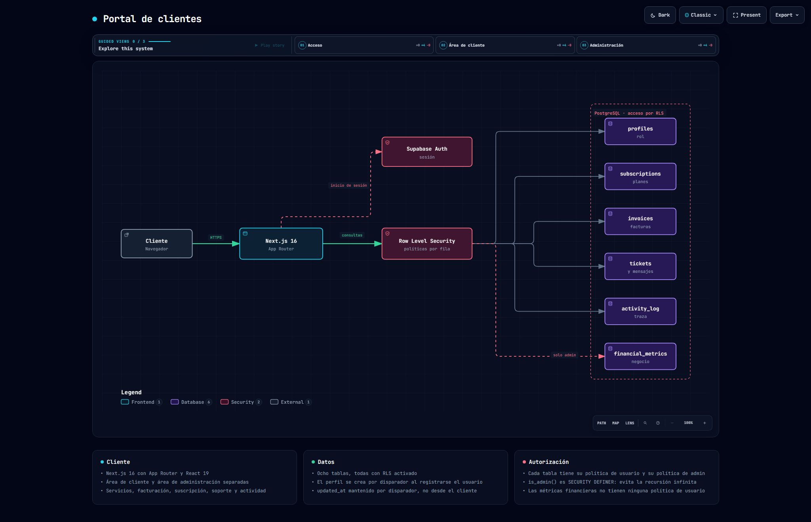

# Portal de clientes

Área privada para los clientes de una agencia: consultar sus servicios contratados, su suscripción,
sus facturas y abrir incidencias. Con un panel de administración aparte para gestionar usuarios,
cobros y soporte.

Desarrollado para cliente · Next.js 16 · React 19 · Supabase



> Diagrama generado con [Archify](https://github.com/tt-a1i/archify) a partir del código de este
> repositorio. Especificación en [`docs/arquitectura.architecture.json`](docs/arquitectura.architecture.json);
> versión navegable en [`docs/arquitectura.html`](docs/arquitectura.html).

---

## Dos áreas, una base de datos

No hay servidor propio ni API intermedia. La aplicación habla directamente con PostgreSQL a través
de Supabase, y **quién puede ver qué se decide en la base de datos**, con políticas de seguridad a
nivel de fila.

Eso significa que el panel de administración no es una zona protegida por una comprobación en el
cliente: si un usuario normal pidiera la tabla de métricas financieras, Postgres le devolvería cero
filas, no un error de interfaz.

| Área | Rutas |
|---|---|
| Cliente | Servicios, facturación, suscripción, soporte, actividad, ajustes |
| Administración | Usuarios, suscripciones, finanzas, tickets, ajustes |

## El detalle que no es obvio: la recursión

Para saber si alguien es administrador hay que mirar su fila en `profiles`. Pero `profiles` tiene
sus propias políticas de lectura, que a su vez llaman a esa comprobación, que vuelve a consultar
`profiles`... y Postgres aborta con un error de recursión infinita.

La salida es sacar la comprobación fuera de las políticas, a una función que se ejecuta con los
privilegios de su creador y por tanto **no vuelve a pasar por RLS**:

```sql
CREATE OR REPLACE FUNCTION public.is_admin(user_id UUID)
RETURNS BOOLEAN AS $$
BEGIN
  RETURN EXISTS (
    SELECT 1 FROM public.profiles
    WHERE id = user_id AND role = 'admin'
  );
END;
$$ LANGUAGE plpgsql SECURITY DEFINER;
```

Con eso, cada política de administrador queda en una línea:

```sql
CREATE POLICY "Admins can view all profiles" ON profiles
FOR SELECT USING (public.is_admin(auth.uid()));
```

## Las tablas

Ocho tablas, **todas con RLS activado**, y 32 políticas repartidas entre ellas:

| Tabla | Políticas | Contenido |
|---|---|---|
| `profiles` | 5 | Perfil y rol |
| `subscriptions` | 5 | Plan contratado |
| `invoices` | 5 | Facturación |
| `tickets` | 6 | Incidencias |
| `ticket_messages` | 4 | Conversación de cada incidencia |
| `activity_log` | 3 | Traza de acciones |
| `financial_metrics` | 2 | Métricas de negocio, solo administración |
| `settings` | 2 | Configuración |

`financial_metrics` es la única sin ninguna política de usuario: para un cliente esa tabla
sencillamente no existe.

## El perfil se crea solo

Registrarse en Supabase Auth crea una fila en `auth.users`, que es un esquema del que la aplicación
no es dueña. El perfil de la aplicación lo crea un disparador enganchado a ese alta:

```sql
CREATE OR REPLACE FUNCTION public.handle_new_user()
RETURNS TRIGGER AS $$
BEGIN
  INSERT INTO public.profiles (id, email, full_name)
  VALUES (NEW.id, NEW.email, COALESCE(NEW.raw_user_meta_data->>'full_name', NEW.email));
  RETURN NEW;
END;
$$ LANGUAGE plpgsql SECURITY DEFINER;
```

Así no puede existir un usuario autenticado sin perfil, que es lo que pasaría si la fila se creara
desde el cliente y esa llamada fallara. Las marcas de `updated_at` también las mantienen
disparadores, no la aplicación.

## Estructura

```
src/
├── app/
│   ├── page.tsx  login/  signup/
│   ├── dashboard/
│   │   ├── services  billing  subscription
│   │   ├── support   activity  settings
│   │   └── admin/    users  subscriptions  finances  tickets  settings
│   └── layout.tsx
├── components/       AuthProvider · Sidebar · LoadingScreen
└── lib/supabase.ts
supabase_schema.sql   tablas, políticas, funciones y disparadores
```

## Puesta en marcha

```bash
npm install
npm run dev
```

Con un `.env.local`:

```
NEXT_PUBLIC_SUPABASE_URL=
NEXT_PUBLIC_SUPABASE_ANON_KEY=
```

Y [`supabase_schema.sql`](supabase_schema.sql) ejecutado en el proyecto de Supabase: crea las
tablas, activa RLS, define las políticas y engancha los disparadores.
